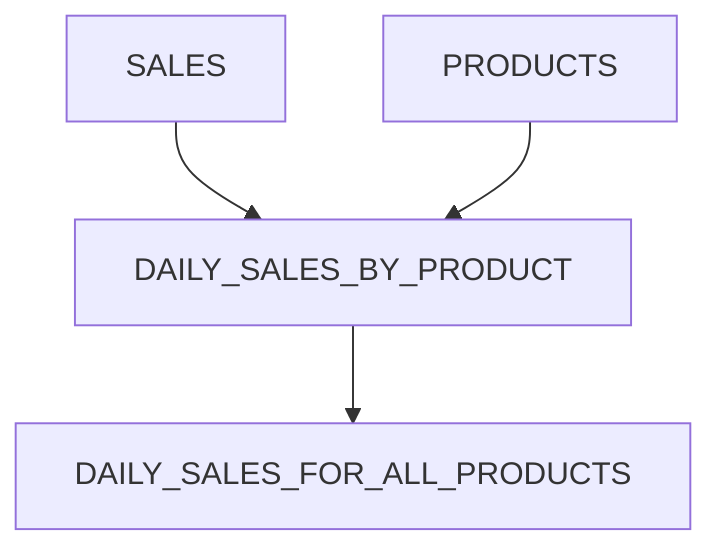
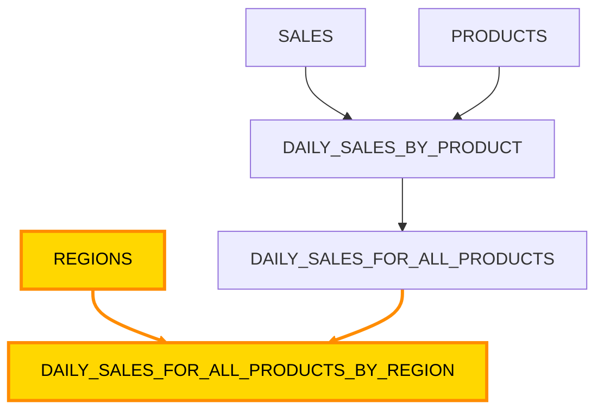

## Here's How Starlake Makes It Simple (Across Airflow, Dagster, and Snowflake Tasks)

Orchestrating data pipelines is one of the most demanding, and often underestimated, parts of a data engineer's job. Between:
- handling dependencies, 
- ensuring idempotency, 
- managing retries, 
- keeping environments aligned, 
- coordinating transformations, 
- and **maintaining lineage** 
the orchestration layer quickly becomes a source of complexity.

In this article, we walk through the most common orchestration challenges data teams face today, and explain how Starlake solves them on top of your existing orchestrators , whether you run Airflow, Dagster, or Snowflake Tasks.

No replacement. No lock-in. No proprietary runtime. Just orchestration made both simpler and more powerful.

### Challenge: Manual DAG creation = fragile, slow, and error-prone

Building DAGs by hand means translating business logic into technical glue code.
Every new dependency, every new table, every new join requires another update.
And the more DAGs you maintain, the more risk you inherit: circular dependencies, missing triggers, duplicated logic, silent breakage.

How Starlake helps ?

Starlake generates DAGs automatically from your model's 100% pure SQL.
You define the "what" and Starlake handles the "how".

Under the hood:
- It infers dependencies from your SQL (thanks to automatic lineage extraction).
- It produces orchestrator-specific DAGs or jobs with all the wiring done.
- It updates dependencies automatically when logic changes

No more manual DAG edits.

You get orchestration that stays in sync with your pipeline definitions, not the other way around.


### Challenge: Understanding lineage requires expensive tools or manual work

Most orchestrators don't give lineage for free.
When they do, it's usually:
- partial
- tied to their own runtime
- dependent on custom decorators or macros

How Starlake helps ?

Starlake generates lineage from standard SQL.
No macros. No proprietary constructs. No vendor dependencies.

This means:
- Paste an analyst's SQL and instantly get the lineage
- You get lineage that's portable, open, and derived from the source of truth: your queries.

⸻


## Our use case
We will describe the numerous challenges associated with orchestrating data pipelines and demonstrate how Starlake helps address them using a simple example.

The example involves four tables:

* SALES: Contains raw sales data, which is loaded from a CSV file and arrives daily.

* PRODUCTS: Contains product information, which is loaded from a CSV file and is fully refreshed every month.

* DAILY_SALES_BY_REGION: Aggregates sales data daily by region, joining the SALES and PRODUCTS tables.

* DAILY_SALES_FOR_ALL_REGIONS: Aggregates the regional sales data daily to provide a global view.

Looking at this example, it is  clear that there are dependencies between these tables, as shown in the following diagram:



We do not need to manually create DAGs or jobs for orchestrating the data pipelines. Starlake automatically generates them based on the SQL definitions of the tables and their dependencies.

Starlake will even check periodically for the files arrival and trigger the pipelines accordingly.

Starlake will generate the appropriate DAGs or jobs for your orchestrator of choice (Airflow, Dagster, Snowflake Tasks), ensuring that the dependencies are correctly managed and that the pipelines are executed in the right order.

# Partial DAG execution
In scenarios where only specific tables are affected by changes (e.g., SALES table receiving daily updates), Starlake optimizes execution by generating DAGS running only the necessary parts of the DAG. This targeted approach minimizes resource usage and reduces execution time, ensuring efficient pipeline management.

In our example, imagine we have a REGION reference table that is updated regurlarly and that we have the following dependency graph:


If only the REGIONS table is updated, Starlake run a DAG that only reprocesses the DAILY_SALES_FOR_ALL_PRODUCTS_BY_REGION table, skipping the other tables that are unaffected by the change. This selective execution ensures that resources are used efficiently and that the data pipeline remains responsive to changes in the data landscape.

This is made possible because Starlake generates **one task per model** and **automatically tracks the dependencies between tables** and understands which tables need to be reprocessed based on the changes in the source data.

## Backfill support
Starlake supports backfilling data pipelines by running DAGs that can reprocess historical data based on specified date ranges or conditions. This feature is particularly useful for scenarios where data corrections or updates are needed for past periods.

In our example, if we need to backfill the DAILY_SALES_BY_PRODUCT table for a specific date range due to data corrections in the SALES table, Starlake can generate a DAG that reprocesses only the affected dates. This targeted backfilling ensures that we maintain data integrity without having to reprocess the entire dataset, saving time and computational resources.


# DAG Generation: One Codebase, Any Orchestrator

Write the config file below:
```yaml
---
version: 1
dag:
  comment: "dag for loading all {{domain}} tables"
  template: "load/airflow__scheduled_table__shell.py.j2"
  filename: "airflow_{{domain}}_tables.py"
  options:
    sl_env_var: "{\"SL_ROOT\": \"{{SL_ROOT}}\", \"SL_ENV\": \"PG\"}"
    SL_STARLAKE_PATH: "starlake"
    tags: "{{domain}}"
    pre_load_strategy: "imported"
    incoming_path: "{{SL_ROOT}}/datasets/incoming"
    global_ack_file_path: "{{SL_ROOT}}/datasets/incoming/{{domain}}/ack"
    ack_wait_timeout: "60"
```

The example below demonstrates how Starlake automatically generates a DAG to orchestrate your data pipelines, seamlessly adapting to the orchestrator you use—whether Airflow, Dagster, or Snowflake Tasks:

```python
with OrchestrationFactory.create_orchestration(job=sl_job) as orchestration:
    with orchestration.sl_create_pipeline(dependencies=dependencies) as pipeline:

        graphs: Set[TreeNode] = pipeline.graphs

        start = pipeline.start_task()
        pre_tasks = pipeline.pre_tasks()
        if pre_tasks:
            start >> pre_tasks

        end = pipeline.end_task()
        post_tasks = pipeline.post_tasks()
        all_done = None
        if post_tasks:
            all_done = pipeline.sl_dummy_op(task_id="all_done")
            all_done >> post_tasks >> end

        def generate_tasks_for_graph(graph: TreeNode):
          parent_tasks: List[AbstractTask] = list()
          for parent in graph.parents:
              parent_task = pipeline.dependency_to_task(parent.node)
              parent_tasks.append(parent_task)
          task = pipeline.dependency_to_task(graph.node)
          if pre_tasks:
              if len(parent_tasks) > 0:
                  task << parent_tasks
                  pre_tasks >> parent_tasks
              else:
                  pre_tasks >> task
          else:
              if len(parent_tasks) > 0:
                  start >> parent_tasks
                  task << parent_tasks
              else:
                  start >> task
          if all_done:
              task >> all_done
          else:
              task >> end
        
        for graph in graphs:
            generate_tasks_for_graph(graph)

pipelines = [pipeline]
```


## Conclusion
Orchestrating data pipelines is a complex task that requires careful management of dependencies, retries, and lineage. 

Starlake simplifies this process by:
1. automating DAG generation, 
2. providing comprehensive lineage tracking,
3. optimizing execution through partial DAG runs and backfill support. 
4. ensuring seamless integration with popular orchestrators like Airflow, Dagster, and Snowflake Tasks.


By leveraging Starlake, data teams can focus on defining their data transformations in SQL, while Starlake handles the orchestration complexities, ensuring robust, efficient, and maintainable data pipelines.

That's how Starlake makes orchestrating data pipelines simple and effective, all this on your existing orchestrator of choice!
