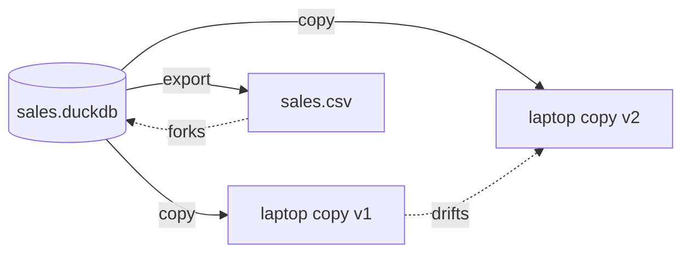
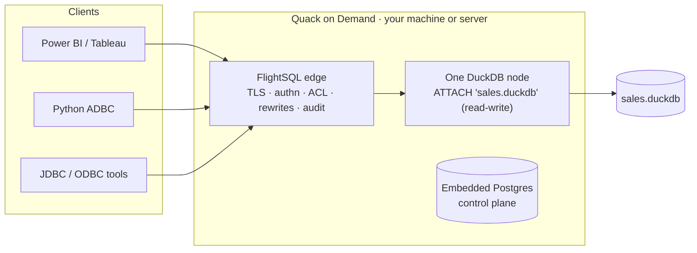
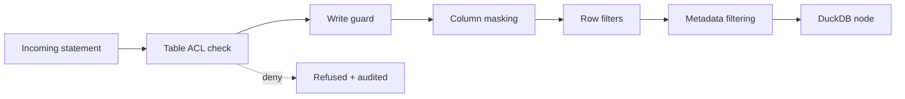

## Abstract

You have a `.duckdb` file. There are two ways to put it to work:

```bash
duckdb sales.duckdb                 # open it embedded, in your process
uvx qod@latest serve ./sales.duckdb # serve it, behind a secured endpoint
```

Same file, same bytes, same engine. Nothing is copied, converted or imported. What changes is everything around the query: who can reach the data, how many people at once, how they prove who they are, which tables and rows they see, and what gets recorded.

This paper is a side-by-side reference for that choice. It compares the embedded open and the served open dimension by dimension: access path, concurrency, identity, authorization, network reach and operations. It closes with when to move the tables into a DuckLake catalog instead.

<!-- truncate -->

## 1. What the embedded open gives you

Credit first: the embedded open is the reason the file exists. DuckDB runs inside your process, reads the file through its own buffer manager, uses every core, and returns results with zero network hops and zero serialization. For one person and one process, nothing beats it.

| Property | Embedded DuckDB on a file |
|---|---|
| Setup | None. The CLI or a client library opens the file directly |
| Latency | In-process: no wire, no serialization, results are already in your memory space |
| SQL surface | Everything DuckDB ships, including extensions, `ATTACH`, `COPY`, full DDL and DML |
| Transactions | ACID within the file, MVCC, single-writer |
| Portability | The file is self-contained: copy it, ship it, open it anywhere DuckDB runs |

The concurrency contract is explicit in DuckDB's documentation and it is a design choice, not an oversight:

- Within one process: many connections, concurrent reads and writes under MVCC with optimistic concurrency control.
- Across processes: either one process holding the file read-write, or several processes holding it read-only. Never both.

DuckDB takes a lock on the file to enforce this. The lock is what makes the single file trustworthy: no torn writes, no external coordination service, no WAL server. Keep that in view for the rest of the paper, because serving the file does not remove the lock. It relocates it to a process that is built to be shared.

## 2. Where the embedded open stops

The contract above is per-process, and teams are not processes. The moment a second person wants the data, one of these improvisations usually appears:

| Improvisation | What actually happens |
|---|---|
| Copy the file around | Copies drift immediately; nobody knows which one is current |
| Put it on a shared drive | The write lock and file-locking semantics over network filesystems bite; readers block writers or corrupt reads are risked |
| Everyone opens read-only | Works until someone needs to write; updates require coordinating a "everybody out" window |
| Export to CSV for the analyst | The data leaves the database, loses types, and forks |
| Give everyone SSH to the box | One OS user, no per-person identity, no policy, full file access for all |



None of these failures is a DuckDB defect. An in-process library has no place to hang a user account, an access policy or an audit trail: there is no server to enforce them. That layer has to live in a process that sits between the users and the file. This is exactly the pattern the Quack protocol anticipates: front the engine with a proxy that owns the shared concerns.

## 3. The served open

```bash
uvx qod@latest serve ./sales.duckdb
```

One command provisions a tenant, a database of kind `duckdb-file`, and a pool around the file, then prints the JDBC, ADBC and ODBC connection strings. The control plane runs on a bundled embedded Postgres under your user data dir and persists across restarts. Re-running `qod serve` with another target adds a second database beside the first, extending the same gateway.

The secure posture is on from the first run: TLS on the FlightSQL edge, database authentication on, table ACLs on, and a random admin password generated once and printed once.




The engine inside the node is stock DuckDB. Every statement still runs on one DuckDB instance against your file; QoD adds no query execution of its own.

## 4. The comparison, dimension by dimension

The at-a-glance table, then the why per row.

| Dimension | Embedded DuckDB | QoD over the same file |
|---|---|---|
| Access path | In-process API (CLI, Python, R, Java, ...) | Arrow Flight SQL endpoint: ADBC, JDBC, ODBC |
| Concurrent users | One writing process, or multiple read-only processes | Many authenticated sessions through one serving node |
| Identity | The OS user who can read the file | Database users, JWT, or OIDC per session |
| Authorization | File permissions: all tables or nothing | Table ACLs, write guard, column masking, row filters |
| Network reach | None; the file must be local to the process | TLS endpoint any FlightSQL client can reach |
| BI tools | Via file copies or exports | Live connections; only result rows leave the server |
| Audit | None | Per-statement history with user attribution |
| Observability | None | Prometheus metrics, cloud sinks, admin UI, Grafana dashboards |
| Engine, file format, SQL dialect | DuckDB | Same DuckDB, same file, unchanged |

### 4.1 Access path and clients

Embedded access means linking DuckDB into each consumer. That is perfect for applications and scripts, and unworkable for tools that speak wire protocols: BI tools, notebooks on other machines, services in other languages.

The served file is one Arrow Flight SQL endpoint. Any ADBC driver connects natively; JDBC and ODBC bridges cover the BI estate (the Power BI walkthrough is in the QoD quickstart). Result sets stream back as Arrow batches, so columnar data stays columnar end to end.

### 4.2 Concurrency

| | Embedded | Served |
|---|---|---|
| Readers | Many, if every process opens read-only | Many concurrent sessions |
| Writers | One process, and then no other process at all | Many sessions; DuckDB MVCC arbitrates inside the one node |
| Reader + writer mix | Not across processes | Yes, across sessions |
| Coordination burden | On the team (locks, windows, copies) | On the serving node, by construction |

The single-writer lock does not disappear; it is honored precisely. One node attaches the file read-write and everyone shares that node's MVCC. Two sessions writing conflicting rows resolve exactly as two connections in one embedded process do, because that is literally what they are. What you gain is that "process" no longer means "one person's terminal".

### 4.3 Identity and authentication

Embedded, identity is the OS: whoever can read the file is everyone at once, with no way to tell them apart.

Served, each session authenticates before a single statement runs. The providers are pluggable and can be combined:

| Provider | Mechanism | Typical use |
|---|---|---|
| Database | Users in Postgres or any JDBC backend, BCrypt passwords | Self-contained teams, the `qod serve` default |
| JWT | External tokens, HS256 / RS256 / PEM verification | Services and agents with existing token infrastructure |
| OIDC | Keycloak (ROPC), Google, Azure AD, AWS Cognito | Enterprise SSO across Azure, GCP and AWS shops |

Account hygiene ships with it: opt-in lockout after repeated failures, self-service password reset over SMTP, and admin-forced password change at next login.

### 4.4 Authorization and data policy

This is the widest gap. A file has one permission: readable or not. A served database enforces policy per statement, at the edge, before the SQL reaches the node, in a fixed order: table ACL check first (the gate that also denies unparseable SQL), then the protected-write guard, column masking, row filtering, and metadata filtering. Every decision is recorded.



Two handshake gates run even earlier (user scope and pool access), then per-statement checks resolve against a cached effective-permission set. Column policies either deny a column or mask it through a SQL transform; row policies append predicate filters. Both are on by default, with `QOD_CLS_ENABLED` / `QOD_RLS_ENABLED` as kill switches.

One honest nuance for file-backed databases: table ACLs, the write guard, row filters, metadata filtering and the audit trail act on the SQL text and the RBAC graph, so they are independent of what backs the database. Column masking additionally resolves a table's column list through the catalog to expand `SELECT *`, and that resolver is DuckLake-backed today. On a `duckdb-file` database, set the unresolved-table mode to deny (`QOD_CLS_UNRESOLVED_TABLE=deny`) if you need star-expansion to fail closed rather than pass through.

### 4.5 Network reach and data residency

Embedded, the file must be on the machine doing the querying, so the data travels to the people.

Served, the people's queries travel to the data. The endpoint is TLS from the first boot (self-signed by default, CA-signed for production). When a BI tool runs a live connection, each interaction issues SQL over the wire, the query runs on the node next to the file, and only the result rows stream back as Arrow batches. The base tables never leave the server, which is the difference between "the analyst has a copy of the database" and "the analyst asked a question".

### 4.6 Operations

| Concern | Embedded | Served |
|---|---|---|
| Who is using it right now | Unknowable | Live node dashboard: in-flight, total served, latency |
| What ran last Tuesday | Unknowable | Statement history with user, verb and outcome |
| Metrics | None | Prometheus `/metrics`, or push to CloudWatch, Azure Monitor, GCP |
| Dashboards | None | Two shipped Grafana dashboards |
| Administration | Editing files, ad-hoc scripts | REST API and a React admin UI (users, ACLs, pools, effective-permission drilldown) |
| Restart behavior | Whoever had it open reopens it | Registry reconciled on boot; dead nodes respawned before the edge accepts traffic |
| Schema browsing | Open the file | Catalog browser in the admin UI (for file-backed databases it queries the running node) |

## 5. When the file should become a DuckLake

Serving the file removes the sharing problem. It does not remove the single-file, single-node shape. Three signals say the shape itself is now the constraint:

1. Read concurrency needs more than one node (many analysts, heavy dashboards): a DuckLake catalog is attached by every node in a pool, so reads fan out.
2. You want history: DuckLake snapshots every committed transaction, with time travel back to any retained snapshot.
3. The data should live in object storage (S3, GCS, Azure) rather than on one disk.

The move stays inside the same gateway: `qod serve` with no target creates a fresh DuckLake database beside the file-backed one, and any DuckDB session that attaches both can `CREATE TABLE ... AS SELECT` the tables across. Clients keep the same endpoint and credentials; the database behind them changes kind. The scale-out and DuckLake papers in this series pick up from there.

## 6. Sources

- DuckDB documentation, "Concurrency": duckdb.org/docs/stable/connect/concurrency
- DuckDB documentation, "ATTACH": duckdb.org/docs/stable/sql/statements/attach
- Quack on Demand repository and README: github.com/starlake-ai/quack-on-demand
- QoD documentation, "DuckLake catalogs" (the three database kinds): docs.starlake.ai/qod/concepts/catalogs
- QoD documentation, "RBAC model": docs.starlake.ai/qod/operating/rbac-model
- QoD documentation, "Access control": docs.starlake.ai/qod/administration/access-control
- QoD quickstart and client connection guides: docs.starlake.ai/qod/getting-started/quickstart

**See also:** [DuckDB access control](https://docs.starlake.ai/qod/duckdb/access-control), [Multi-tenant DuckDB](https://docs.starlake.ai/qod/duckdb/multi-tenant) and [A Flight SQL server for DuckDB](https://docs.starlake.ai/qod/duckdb/flight-sql-server) in the Quack on Demand documentation.
