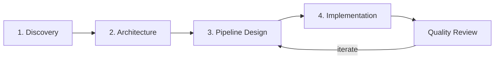

# Starflow Method (Preview)

:::info Preview
Starflow is currently in **preview**. The methodology and skills are available for early adopters, but APIs and workflows may change.
:::

Starflow is an optional guided methodology layer that helps you plan and implement data pipelines step-by-step. While Starlake Skills give you direct access to every CLI command, Starflow provides a structured workflow with specialized agent personas that guide you through the full lifecycle — from domain discovery to production deployment.

## When to Use Starflow

- **Greenfield projects** — Starting a new data platform from scratch
- **Complex migrations** — Moving from legacy ETL to Starlake
- **Team onboarding** — Structured approach for teams new to Starlake
- **Architecture reviews** — Systematic evaluation of existing pipelines

For quick, targeted tasks (loading a file, writing a transform), use the [CLI skills](../0200-catalog/index.md) directly.

## Workflow Phases

Starflow organizes work into four phases, each with dedicated skills:



### Phase 1: Discovery

Map your data landscape before writing any configuration.

| Skill | Description |
|---|---|
| `starflow-domain-discovery` | Identify and document data domains, sources, and ownership |
| `starflow-source-analysis` | Deep-dive into source schemas, quality, volume, and extraction strategies |

### Phase 2: Architecture

Design the platform and schemas that will support your pipelines.

| Skill | Description |
|---|---|
| `starflow-create-data-architecture` | Design layers (landing, bronze, silver, gold), engines, storage, and governance |
| `starflow-schema-design` | Design Starlake-compatible table schemas with types, constraints, privacy, and expectations |

### Phase 3: Pipeline Design

Specify pipelines end-to-end before implementation.

| Skill | Description |
|---|---|
| `starflow-create-pipeline-spec` | Create complete pipeline specifications covering extract, load, transform, and orchestrate |
| `starflow-transform-design` | Design SQL transformations with quality checks and dependency management |
| `starflow-orchestration-design` | Design DAGs for scheduling and managing pipeline execution |

### Phase 4: Implementation

Build, test, and deploy your pipelines.

| Skill | Description |
|---|---|
| `starflow-dev-pipeline` | Generate Starlake configuration files (YAML + SQL) from specifications |
| `starflow-sprint-planning` | Break down pipeline work into sprint-sized tasks with dependency ordering |
| `starflow-code-review` | Review configurations and SQL across five layers before deployment |

### Quality Review

Cross-cutting skills for validating pipelines at any phase.

| Skill | Description |
|---|---|
| `starflow-data-quality-review` | Review expectations coverage and identify gaps across pipelines |
| `starflow-lineage-review` | Trace and document data lineage across pipeline stages |

## Agent Personas

Talk to a specialized agent for guided assistance. Each agent coordinates multiple workflow skills and brings domain expertise:

| Skill | Agent | Specialty |
|---|---|---|
| `starflow-data-analyst` | **Lea** | Domain discovery, source analysis, business requirements |
| `starflow-data-architect` | **Winston** | Architecture, schemas, pipeline design, Starlake configuration |
| `starflow-data-engineer` | **Amelia** | ETL pipeline development, SQL transformations, orchestration |
| `starflow-data-quality-engineer` | **Quinn** | Expectations framework, data profiling, privacy compliance |
| `starflow-platform-engineer` | **Max** | Infrastructure, orchestration deployment, CI/CD |

```
You: /starflow-data-architect Design a data platform for our e-commerce analytics
```

## Navigation

Use `starflow-help` at any time to get recommendations on what to do next based on your project's current state:

```
You: /starflow-help What should I work on next?
```

## Getting Started

1. Run `/starflow-help` to assess your project state and get recommendations
2. Begin with `/starflow-domain-discovery` to map your data landscape
3. Follow the phases in order, or jump to the phase you need
4. Each Starflow skill references the relevant Starlake CLI skills for implementation details