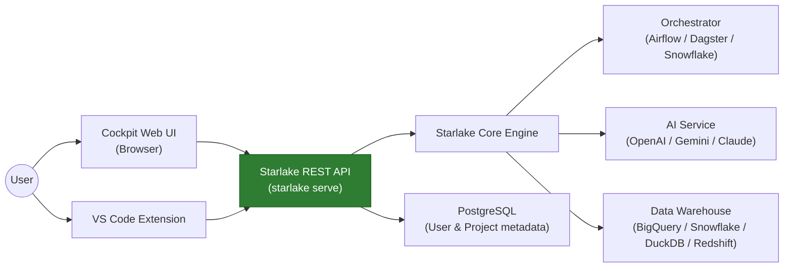

import Head from '@docusaurus/Head';

<Head>
  <script type="application/ld+json">
    {JSON.stringify({
      "@context": "https://schema.org",
      "@type": "FAQPage",
      "mainEntity": [
        {
          "@type": "Question",
          "name": "What is the Starlake Cockpit?",
          "acceptedAnswer": {
            "@type": "Answer",
            "text": "The Starlake Cockpit is a web-based interface for managing Starlake data projects. It provides tools for data extraction, loading, transformation, orchestration, testing, and more. Launch it with 'starlake serve' and open http://localhost:9900."
          }
        },
        {
          "@type": "Question",
          "name": "How do I launch the Starlake Cockpit?",
          "acceptedAnswer": {
            "@type": "Answer",
            "text": "Run 'starlake serve' from your terminal. The Cockpit opens at http://localhost:9900 by default. You can change the port with the SL_API_HTTP_PORT environment variable."
          }
        }
      ]
    })}
  </script>
</Head>

# Cockpit Overview

The Starlake Cockpit is a web-based interface for managing your data projects end-to-end. It connects to the Starlake REST API backend and provides a visual environment for every stage of the data pipeline: extraction, loading, transformation, orchestration, testing, and monitoring.

## Architecture

Users interact with Starlake through two entry points: the **Cockpit Web UI** or the **VS Code Extension**. Both connect to the Starlake REST API, which orchestrates the underlying data engine and manages project metadata.



## Setup

Launch the Cockpit with:

```bash
starlake serve
```

Then open `http://localhost:9900` in your browser.

### Command Options

```bash
starlake serve [options]
```

| Option | Description | Default |
|--------|-------------|---------|
| `--host <value>` | Address on which the server listens | `127.0.0.1` |
| `--port <value>` | Port on which the server listens | `9900` |
| `--reportFormat <value>` | Report format: `console`, `json`, or `html` | `console` |

The host and port can also be set through environment variables `SL_HTTP_HOST` and `SL_HTTP_PORT`.

### Examples

Listen on all interfaces on port 11000:

```bash
starlake serve --host 0.0.0.0 --port 11000
```

See the [Configuration](./0200-configuration.mdx) page for deployment options, authentication providers, and all environment variables.

:::tip Store data outside the installation folder
When creating projects through the Cockpit UI, projects and the management database are stored in the `starlake` installation folder by default. To ensure they survive reinstalls and upgrades, configure an external location using these environment variables before creating any projects:

- **`SL_API_PROJECTS_ROOT`** — path where projects are stored
- **`SL_API_JDBC_URL`** — JDBC URL for the user and project management database (PostgreSQL)

```bash
export SL_API_PROJECTS_ROOT=/path/to/my/projects
export SL_API_JDBC_URL=jdbc:postgresql://localhost:5432/starlake
```
:::

## Projects

The home screen lists all projects in your workspace. From here you can create new projects, switch between existing ones, and manage workspace-level users. Each project has its own settings, connections, and pipeline definitions.

Within a project, members are assigned one of three roles: **Admin** (full access including settings and user management), **Owner** (project-level control), or **User** (read and execute access).

## Data Extraction

The Extraction section lets you configure jobs that pull schemas and data from external databases. You can create, edit, and delete extract configurations, each targeting a specific connection. The UI also supports extracting schemas from external sources to bootstrap load configurations.

## Data Loading

The Loading section organizes ingestion configurations by domain and table. You can browse load configurations by folder, edit domain-level and table-level settings, and configure file formats (CSV, JSON, XML, position-based), metadata, write strategies, and schema definitions.

## Data Transformation

The Transformation section provides a notebook-style editor for SQL and Python transform jobs. You can create and edit jobs, validate SQL syntax against the target database, and preview transformation logic. Each job maps to a named transform that can be orchestrated independently.

## Semantic Modeling

The Semantic Modeling section offers a visual diagram editor for defining domains, tables, and their relationships. You can drag and arrange entities, define columns and types, and visualize the data model as an interactive flow diagram powered by React Flow.

## SQL Worksheet

The SQL Worksheet is an interactive editor for running ad-hoc queries against your project data. It supports syntax highlighting, autocompletion, and result display in a data grid. Use it to explore data, validate queries, or test transformation logic before committing it to a job.

## Orchestration

The Orchestration section manages workflow scheduling and execution. You can build DAGs from templates, generate orchestration code for Airflow, Dagster, or Snowflake tasks, and trigger runs directly from the UI. The schedule configuration page lets you define cron-based schedules for automated pipeline execution.

## Data Quality and Testing

The Testing section lets you define and run data quality checks using expectations. You can configure tests per job, run them against live data, and view results. The monitoring dashboard tracks data freshness and surfaces quality metrics over time.

## Git Integration

The Git section provides full version control for your project metadata. You can view status, stage and commit changes, create and switch branches, push to and pull from remotes, and resolve merge conflicts. The version history page shows the commit log for your project.

## AI Assistant

The AI Assistant is available across the Loading and Transformation sections as a chat interface. It can generate column descriptions from sample data, explain SQL queries, suggest fixes for errors, and help scaffold new configurations. Responses stream in real time.

## Settings

The Settings section groups all project configuration:

- **General** — project name, description, and metadata
- **Application** — application YAML configuration with validation
- **Connections** — database connection templates and credentials
- **Environment Variables** — project-level key-value pairs for pipeline configuration
- **Custom Types** — user-defined data types alongside built-in defaults
- **Schedule** — job scheduling configuration
- **Members** — project team members, roles, and invitations
- **Git References** — branch and tag management
