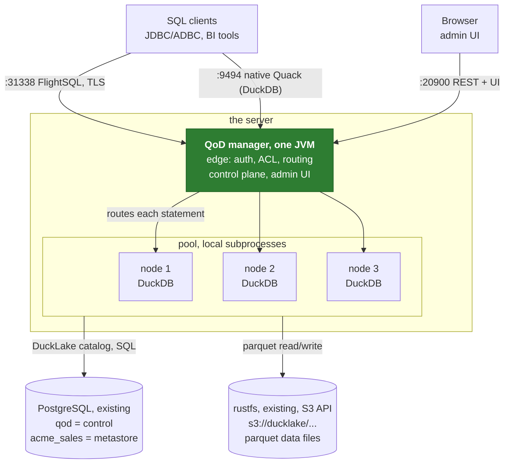
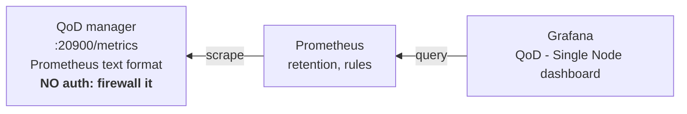

Audience: DBA / platform engineer deploying for production use.
Scenario: one large server, multiple concurrent users, an existing PostgreSQL instance and an existing S3-compatible object store. The examples use rustfs; MinIO, Ceph RGW, or any other S3 API works the same way.

> **In a hurry?** Jump straight to [Appendix A](#appendix-a-full-provisioning-script-one-pool-of-three-dual-nodes): one commented script that takes a fresh server to a served database (three dual nodes on rustfs), then [Appendix B](#appendix-b-roles-and-groups-scripts) for the roles and groups scripts. Come back to the sections when you need the why behind a line.

---

## 0. Recommended architecture

The two external dependencies QoD needs (Postgres and an S3-compatible store) are already in place, so the recommended layout is:

| Component | Where it runs | Role |
|---|---|---|
| QoD manager | The server (one JVM process) | REST control plane + admin UI on `:20900`, FlightSQL edge on `:31338`, native Quack front door on `:9494` (DuckDB `ATTACH`) |
| Quack nodes | The server, spawned as local subprocesses (`runtimeType = "local"`) | DuckDB engines executing user SQL |
| Control-plane state | Existing PostgreSQL (database `qod`) | Tenants, pools, users, RBAC, audit, statement history |
| DuckLake metastore | Existing PostgreSQL (one database per tenant-db, `<tenant>_<name>`) | Table/snapshot metadata |
| Data files | Existing rustfs, via its S3 API (`s3://...`) | Parquet data written by DuckLake |
| Grafana | Anywhere with network access to the server | Dashboards (see sections 7 and 8) |



Key decisions:

1. **Local runtime.** On a single machine `runtimeType = "local"` (the default) spawns nodes as subprocesses of the manager; no container platform is required.
2. **Point the default metastore at the existing Postgres** with the `QOD_PG_*` variables. Every tenant-db created without explicit metastore overrides inherits it.
3. **Point the data path at rustfs** using an `s3://` data path plus S3 credentials (path-style URLs). Optionally enable managed storage so QoD carves per-database prefixes out of one root bucket:

```bash
export QOD_MANAGED_STORE_ENABLED=true
export QOD_MANAGED_STORE_ENDPOINT=http://rustfs:9000
export QOD_MANAGED_STORE_REGION=us-east-1
export QOD_MANAGED_STORE_BUCKET=qod-managed
export QOD_MANAGED_STORE_ACCESS_KEY_ID=...
export QOD_MANAGED_STORE_SECRET_ACCESS_KEY=...
export QOD_MANAGED_STORE_URL_STYLE=path
```

   Important: the rustfs bucket used as the managed root must have **versioning OFF**, otherwise deleted data is never really purged.
4. **Enable security before exposing anything**: `QOD_ACL_ENABLED=true` (enforce grants), rotate `QOD_ADMIN_PASSWORD`, keep TLS on the FlightSQL edge, set `QOD_API_KEY` or rely on login sessions for `/api`.

### 0.1 The complete environment for this deployment

```bash
# --- Control plane + default DuckLake metastore: the existing Postgres ---
export QOD_PG_HOST=pg.internal
export QOD_PG_PORT=5432
export QOD_PG_USER=qod            # must hold CREATEDB (QoD creates one DB per tenant-db)
export QOD_PG_PASSWORD=...
export QOD_PG_DBNAME=qod          # control-plane database

# --- Data files: the existing rustfs, via its S3 API ---
export QOD_DUCKLAKE_DATA_PATH=s3://ducklake/qod   # bucket must already exist (see below)
export QOD_S3_ENDPOINT=rustfs.internal:9000
export QOD_S3_ACCESS_KEY_ID=...
export QOD_S3_SECRET_ACCESS_KEY=...
export QOD_S3_REGION=us-east-1
export QOD_S3_URL_STYLE=path      # path style for rustfs/MinIO (vhost is for AWS)
export QOD_S3_USE_SSL=false       # true if rustfs is behind TLS

# --- Security ---
export QOD_ACL_ENABLED=true
export QOD_ADMIN_PASSWORD='<strong password>'

# --- Manager JVM heap (no default is set otherwise; never give it more than 2g) ---
export JAVA_OPTS=-Xmx2g
```

rustfs caveats to respect:

- **Create the bucket first** (`aws s3 mb s3://ducklake --endpoint-url http://rustfs.internal:9000`). rustfs does not auto-create buckets, and a missing bucket surfaces later as a confusing S3 error at node spawn.
- **Versioning OFF** on any bucket used by the managed store, otherwise purges leave invisible billed versions behind.
- Keep one Postgres metastore database per storage location: the DuckLake catalog persists the absolute data path on first write, so re-pointing an existing metastore at a different path breaks.
- If the site uses an HTTP proxy, add rustfs and Postgres hosts to `NO_PROXY`, or DuckDB's S3 writes route through the proxy and fail.

### 0.2 Boot and verify

Use the native `qod` CLI, not Docker. The manager spawns Quack nodes as local subprocesses, so running natively keeps the per-node CPU/memory budgets of section 3 exact; a single container would put the manager and every node under one shared cgroup. The docker-compose stack is an evaluation rig that bundles its own Postgres, rustfs, and Grafana (all already in place here) with insecure demo defaults.

| Step | Command | Expected result |
|---|---|---|
| 1. Install the CLI | `pip install qod` | `qod` on PATH. Nothing else to install: the CLI provisions the JRE and the pinned DuckDB itself |
| 2. Load the environment | export the block from 0.1 | Postgres, rustfs, and security variables set in the shell |
| 3. Start the manager | `qod start` | First boot downloads the JRE and DuckDB, generates TLS certs, and creates the control-plane database; log shows `auth: providers configured` |
| 4. Check health | `qod status` | Manager healthy, FlightSQL edge port listening |
| 5. Verify the UI | open `http://<host>:20900/ui/` | Login page; the rotated `QOD_ADMIN_PASSWORD` works |
| 6. Verify metrics | `curl http://<host>:20900/metrics` | Prometheus text output (section 7) |
| 7. Stop | `qod stop` | Clean shutdown |

Notes:

- The manager creates its own Postgres databases over JDBC at startup (0.8.3+): the control-plane database at preflight and one database per tenant-db at bootstrap, which is why the QoD Postgres user needs `CREATEDB`. On earlier releases, create the control-plane database once by hand (`CREATE DATABASE qod;`).
- A system `duckdb` on PATH is deliberately ignored to avoid ABI mismatches.
- For production, wrap `qod start` in a systemd unit so the manager restarts on boot; reconcile respawns the node processes automatically.

---

## 1. How QoD serves multiple users simultaneously on one server

QoD is a multi-tenant FlightSQL gateway built exactly for this:

- Users connect concurrently to the single FlightSQL edge (`:31338`) with their own credentials.
- The manager routes each statement to a node (DuckDB process) in the target pool using least-loaded routing (cache-aware placement on object-store pools), so concurrent statements spread across nodes.
- A single node also executes multiple statements simultaneously: sessions share the node's `threads` and `memory_limit` budgets, and the per-pool `maxConcurrentPerNode` cap (default unbounded) bounds how many stack up on one node.

```mermaid
graph LR
  alice["alice"]
  bob["bob"]
  carol["carol"]
  edge["edge :31338<br/>auth, ACL"]
  router["router<br/>least-loaded,<br/>cache-aware"]
  n1["node 1<br/>inFlight 2"]
  n2["node 2<br/>inFlight 1 &#8592; next"]
  n3["node 3<br/>inFlight 2"]
  alice --> edge
  bob --> edge
  carol --> edge
  edge --> router
  router --> n1
  router --> n2
  router --> n3
  style n2 fill:#2e7d32,stroke:#1b5e20,color:#fff
```



---

## 2. System requirements

### 2.1 Software prerequisites

| Component | Requirement |
|---|---|
| PostgreSQL | 16+; the QoD Postgres user needs `CREATEDB` (one database is auto-created per tenant-db) |
| OS | Linux or macOS; Windows native is experimental (PowerShell scripts), Docker on Windows requires WSL2 |

Everything else is provisioned by `qod start` itself: a Temurin 21 JRE when no 21+ JVM is present (`JAVA_BIN` forces a specific one) and the pinned DuckDB build (a system `duckdb` on PATH is deliberately ignored to avoid ABI mismatches).

### 2.2 Hardware guidance

| Component | Guidance |
|---|---|
| Manager JVM | Modest: plan 2 CPUs. Set the heap explicitly to `JAVA_OPTS=-Xmx2g` and **never more than 2 GB**; no default `-Xmx` is applied. RAM belongs to the nodes, not the manager |
| Node (DuckDB process) | Keep roughly **1 vCPU : 4 GiB RAM**; do not go below 4 GiB per node. This matches DuckDB's official guidance of 1 to 4 GB per thread, with 3 to 4 GB per thread for join-heavy workloads (duckdb.org performance guide) |
| Data-size heuristic | A node handles TPC-H at a scale factor of roughly 3x its RAM in GiB (e.g. 32 GiB node: SF100, about 26 GB stored) |
| Disk | Fast local disk for DuckDB spill (`temp_directory`); spill must never point at the object store |

Sizing validation and the known limitations to plan around live in [Appendix C](#appendix-c-sizing-validation-and-known-limitations).

---

## 3. Configuring CPU, threads, and memory limits

**The single most important single-server fact:** nothing caps a node by default. DuckDB's own defaults read the host: each node would claim about 80% of the machine's RAM and all its cores. With several nodes on one server you **must** set explicit per-node budgets.

### 3.1 Per-node DuckDB budgets via initSql

Set them per database (every node serving that database) or per pool. Pool `initSql` runs after database `initSql`, so a pool-level `SET` wins; use that to give the `etl` pool a bigger budget than `bi`.

```bash
# Database-level default for all pools of acme_sales
qod database update --tenant acme --name acme_sales \
  --init-sql "SET memory_limit='24GB'; SET threads=8; SET temp_directory='/fastdisk/duckdb-tmp';"
```

Rules:

- `memory_limit`: per-node share of RAM, at about 80% so DuckDB spills to disk before the OS OOM-killer fires.
- `threads`: per-node CPU share; keep close to the 1 vCPU : 4 GiB ratio.
- `temp_directory`: fast local disk, never the object store.
- Never put credentials in `initSql` (it is stored unredacted); engine settings only.
- Editing a database's `initSql` restarts its nodes immediately; pool `initSql` applies on the next node spawn.

### 3.2 Worked example: 64 vCPU / 256 GiB server

| Consumer | CPU | Memory |
|---|---|---|
| Manager JVM (`JAVA_OPTS=-Xmx2g`) | 2 | 2 GiB |
| Pool `bi`: 5 read nodes + 1 write node, each `threads=6`, `memory_limit='24GB'` | 36 | 144 GiB budget |
| Pool `etl`: 2 dual nodes, each `threads=10`, `memory_limit='40GB'` | 20 | 80 GiB budget |
| Headroom (page cache, spill, bursts) | | 30 GiB |

```mermaid
graph TD
  subgraph budget["RAM 256 GiB &#183; CPU 64 cores"]
    direction TB
    jvm["manager JVM<br/><b>2 GiB</b> &#183; 2 cores"]
    bi["pool bi &#183; 6 nodes x 24 GiB<br/><b>144 GiB</b> &#183; 36 cores, 6 x 6 threads"]
    etl["pool etl &#183; 2 nodes x 40 GiB<br/><b>80 GiB</b> &#183; 20 cores, 2 x 10 threads"]
    head["headroom &#183; page cache, spill, bursts<br/><b>30 GiB</b>"]
    jvm ~~~ bi ~~~ etl ~~~ head
  end
  style head fill:#f5f5f5,stroke:#9e9e9e,color:#333,stroke-dasharray: 5 4
```



Interactive pools can be modestly oversubscribed on CPU (not every node is busy at once); keep the sum of `memory_limit` under total RAM minus headroom.

### 3.3 The knob table

| What | Knob | Default |
|---|---|---|
| Node memory | `SET memory_limit` in db/pool `initSql` | ~80% of host RAM per node (unbounded in practice): **always set it** |
| Node threads | `SET threads` in db/pool `initSql` | all host cores per node: **always set it** |
| Node spill dir | `SET temp_directory` in `initSql` | DuckDB default |
| Manager heap | `JAVA_OPTS=-Xmx2g` (hard rule: never more than 2g) | none (JVM default) |
| Arrow allocator | `-Darrow.allocation.manager.type=Unsafe` | already set by the start scripts; required |
| Per-node concurrency cap | `maxConcurrentPerNode` on `pool/create` | 0 = unbounded |
| Total local nodes | `QOD_MAX_NODES_TOTAL` | 50 |
| Autoscale band | `minNodes`/`maxNodes` per pool; `QOD_AUTOSCALE_HARD_CAP` | band unset; cap 16 |
| Statement timeout | none globally; `stmtTimeoutMs` on scoped PATs only | none |
| Row caps | `QOD_MCP_MAX_ROWS` (MCP), `QOD_CATALOG_PREVIEW_MAX_ROWS` (UI preview), `maxRows` on PATs | 500 / 1000 / none |
| Edge session TTL | `QOD_SESSION_TTL_SEC` | 3600 |
| UI session idle TTL | `QOD_SESSION_IDLE_TTL_SEC` | 28800 |
| Telemetry queue | `QOD_TELEMETRY_JOURNAL_CAPACITY` | 8192 |

---

## 4. Creating tenants, databases, and pools

The objects nest as follows; sections 4.1 to 4.4 create one level each:

```mermaid
graph TD
  subgraph objects["object nesting"]
    direction TB
    t["tenant <b>acme</b>"]
    d["database <b>acme_sales</b><br/>kind ducklake<br/>dataPath s3://ducklake/acme_sales"]
    p["pool <b>bi</b><br/>1 writeonly + 2 readonly<br/>autoscale band 3..6"]
    n1["node bi-1 &#183; WRITEONLY"]
    n2["node bi-2 &#183; READONLY"]
    n3["node bi-3 &#183; READONLY"]
    t --> d
    d --> p
    p --> n1
    p --> n2
    p --> n3
  end
  subgraph access["access"]
    direction LR
    u["user"] --> g["group"] --> r["role"] --> tg["table grants"]
    cp["GRANT CONNECT ON POOL"]
  end
  classDef proc fill:#e8f5e9,stroke:#2e7d32,color:#1b5e20;
  class n1,n2,n3 proc;
```



All control-plane commands need an authenticated session; `qod auth login` mints one, prompts for the password, and stores it in the CLI profile:

```bash
qod auth login --username admin@yourco.com
```

### 4.1 Create the tenant

```bash
qod tenant create acme
```

### 4.2 Create a database (DuckLake kind, data on rustfs)

Bring-your-own-prefix form (explicit rustfs path and credentials):

```bash
qod database create --tenant acme --name sales --kind ducklake \
  --data-path s3://acme-sales/ducklake \
  --object-store s3_region=us-east-1 \
  --object-store s3_access_key_id=... \
  --object-store s3_secret_access_key=... \
  --object-store s3_endpoint=rustfs.internal:9000 \
  --object-store s3_url_style=path
```

Or, with managed storage enabled (section 0), let QoD allocate the prefix:

```bash
qod database create --tenant acme --name sales --kind ducklake --managed-storage
```

The server composes the full name as `acme_sales`. Postgres metastore keys can be omitted: they resolve from the manager's default metastore (`QOD_PG_*`) at node spawn time.

### 4.3 Create a pool

```bash
# 1 write node + 2 read nodes, with an autoscale band 3..6
qod pool create --tenant acme --db acme_sales --pool bi --size 3 \
  --writeonly 1 --readonly 2 --min-nodes 3 --max-nodes 6
```

Day-2 pool operations: `qod pool scale`, `qod pool suspend` / `qod pool resume` (scale to zero and back; a suspended pool auto-wakes on the first statement), `qod pool stop`, `qod pool delete`, `qod pool set-autoscale` (change or clear the band).

### 4.4 Grant users access

Do it in SQL. Put the grants in a script and run it through the FlightSQL edge with `qod sql --file` (superuser or tenant-admin session):

```sql
-- grants.sql: one analyst role, one user, read access plus pool connectivity
CREATE ROLE analyst;
GRANT SELECT ON acme_sales.main.* TO ROLE analyst;

CREATE USER alice PASSWORD 'Temp123!';
ALTER USER alice REQUIRE PASSWORD CHANGE;
GRANT ROLE analyst TO USER alice;

-- Do not forget pool access: without it the user cannot reach the pool at all
GRANT CONNECT ON POOL bi TO USER alice;

-- Verify
SHOW GRANTS FOR USER alice;
```

```bash
qod sql --superuser --tenant acme --pool bi --file grants.sql
```

For team-scale management, attach roles to groups instead of users (`qod group create`, `ALTER GROUP analysts ADD USER alice`, `qod pool permission grant` for group-level pool access); the effect is identical, and IdP-driven SCIM group sync (section 6.4) plugs into the same groups.

---

## 5. Administering the database with SQL

With `QOD_SQL_ADMIN_ENABLED=true` (the default), a superuser or tenant-admin FlightSQL session can run an admin SQL dialect directly at the edge; it drives the same RBAC state as the REST API and CLI. Keep admin statements in versioned `.sql` scripts and run them fail-fast with:

```bash
qod sql --superuser --tenant acme --pool bi --file admin.sql
```

The dialect:

```sql
-- Users
CREATE USER alice PASSWORD 'secret';
CREATE USER ops PASSWORD 'secret' ADMIN;
ALTER USER alice PASSWORD 'newsecret';
ALTER USER alice REQUIRE PASSWORD CHANGE;
ALTER USER alice DISABLE;
DROP USER IF EXISTS alice;

-- Roles, groups, membership
CREATE ROLE analyst;
GRANT ROLE analyst TO USER alice;
ALTER GROUP finance ADD USER alice;

-- Table grants
GRANT SELECT ON acme_sales.main.orders TO ROLE analyst;
REVOKE ALL ON acme_sales.main.orders FROM ROLE analyst;

-- Row-level and column-level policies
CREATE ROW POLICY ON acme_sales.main.orders FOR ROLE analyst
  USING (region = ${tenantId} OR owner = ${user});
CREATE COLUMN POLICY ON acme_sales.main.customers COLUMN email FOR ROLE analyst
  MASK USING (SHA256(CAST(email AS VARCHAR)));

-- Pool connectivity
GRANT CONNECT ON POOL bi TO USER alice;

-- Introspection
SHOW USERS;
SHOW ROLES;
SHOW GRANTS FOR USER alice;
```

Notes worth passing to the DBA:

- Admin SQL is available on the FlightSQL wire only (not over MCP or REST previews); any ADBC/JDBC client works, e.g. `scripts/adbc.sh`.
- Admin statements commit immediately; they are not covered by a surrounding `BEGIN`.
- `SHOW USERS` / `SHOW ROLES` / `SHOW GRANTS` shadow real tables with those names; quote the identifier (`SHOW "users"`) to reach the table instead.
- Password literals are redacted from statement history and logs.
- Ordinary data DDL/DML (CREATE TABLE, INSERT, etc.) is plain DuckDB SQL routed to the pool's write-capable nodes, governed by the same grants.

---

## 6. Authentication: Google Cloud, Azure, AWS, internal IdP, or database auth

QoD has **two independent auth planes**, configured separately:

| Plane | What it protects | Config block |
|---|---|---|
| FlightSQL data plane | SQL clients on `:31338` (JDBC/ADBC, BI tools) and DuckDB clients on the native Quack front door `:9494` (same handshake and providers) | `quack-flightsql.auth.*` (`QOD_AUTH_*`) |
| Management plane | Admin UI + REST on `:20900` | `quack-on-demand.auth.management.*` (`QOD_MGMT_*`) |

A common production posture: admin UI on corporate SSO, SQL clients on database passwords or bearer JWTs, with database auth kept as break-glass.

```mermaid
graph LR
  browser["Browser<br/>SSO, OIDC, or password"]
  sqlclient["SQL client<br/>password or bearer token"]
  mgmt[":20900 management plane<br/>QOD_MGMT_* / tenant authProvider"]
  data[":31338 FlightSQL data plane<br/>QOD_AUTH_DB_* /<br/>QOD_AUTH_&lt;PROVIDER&gt;_*"]
  state["<b>qodstate_user</b><br/>roles &#183; groups &#183; grants<br/><b>authorization is ALWAYS local</b>"]
  idp["IdP<br/>Keycloak / Entra / Google / Cognito"]
  browser --> mgmt
  sqlclient --> data
  mgmt --> state
  data --> state
  idp -->|"SCIM connector provisions<br/>users + groups"| state
  style state fill:#2e7d32,stroke:#1b5e20,color:#fff
```



### 6.1 Database auth (built-in, default on)

Bcrypt-hashed users in the `qodstate_user` table of the control-plane Postgres. On by default (`QOD_AUTH_DB_ENABLED=true`); nothing to configure beyond the admin seed:

```bash
export QOD_ADMIN_USERNAME=admin@yourco.com   # default: admin@localhost.local,admin
export QOD_ADMIN_PASSWORD='<strong password>' # default: admin. Rotate before go-live.
```

The admin row is re-seeded at every boot, so changing the env var and restarting rotates the credential. Create users with `qod user create --tenant acme --username alice --password ... --role user`, via REST `/api/user/create`, or via SQL `CREATE USER` (section 5). Optional account lockout: `QOD_AUTH_LOCKOUT_ENABLED=true` (requires SMTP: `QOD_SMTP_HOST` etc., plus `QOD_PUBLIC_BASE_URL` for the reset link).

### 6.2 OIDC on the FlightSQL data plane

All providers are off by default; several can be enabled at once (first success wins).

**Internal IdP (Keycloak or any OIDC server):**

```bash
export QOD_AUTH_KEYCLOAK_ENABLED=true
export QOD_AUTH_KEYCLOAK_BASE_URL=https://keycloak.yourco.com
export QOD_AUTH_KEYCLOAK_REALM=yourco
export QOD_AUTH_KEYCLOAK_CLIENT_ID=qod-flightsql
export QOD_AUTH_KEYCLOAK_CLIENT_SECRET=...
```

Supports username/password over FlightSQL (ROPC) and bearer tokens.

**Google Cloud (Google Identity):**

```bash
export QOD_AUTH_GOOGLE_ENABLED=true
export QOD_AUTH_GOOGLE_CLIENT_ID=123456789.apps.googleusercontent.com
export QOD_AUTH_GOOGLE_CLIENT_SECRET=GOCSPX-...
# Optional Workspace group lookup for RBAC groups:
export QOD_AUTH_GOOGLE_GROUPS_LOOKUP=true
export QOD_AUTH_GOOGLE_SVC_ACCT_KEY_PATH=/etc/quack/google-svc-acct.json
```

Google has no password grant: SQL clients present a bearer token (see the token page below).

**Azure (Entra ID):**

```bash
export QOD_AUTH_AZURE_ENABLED=true
export QOD_AUTH_AZURE_TENANT_ID=<directory-id>
export QOD_AUTH_AZURE_CLIENT_ID=<app-registration-id>
export QOD_AUTH_AZURE_CLIENT_SECRET=...
```

Supports both username/password (ROPC) and bearer tokens.

**AWS (Cognito):**

```bash
export QOD_AUTH_AWS_ENABLED=true
export QOD_AUTH_AWS_REGION=us-east-1
export QOD_AUTH_AWS_USER_POOL_ID=us-east-1_AbCdEfGhI
export QOD_AUTH_AWS_CLIENT_ID=<app-client-id>
```

Bearer only, no client secret. Caveat: present the Cognito **id token** (the access token lacks the `aud` claim and fails validation).

**Generic JWT issuer** (non-OIDC): set `JWT_SECRET_KEY` or `JWT_PUBLIC_KEY_PATH` (plus optional `JWT_ISSUER` / `JWT_AUDIENCE`) and any token signed by that key is accepted.

**SSO tokens for JDBC/BI tools**: the manager serves a browser token page at `GET /api/auth/sql-token/start`; the user logs into the IdP and gets a copy-paste `token=` snippet for DBeaver, Power BI, etc. Register `<publicBaseUrl>/api/auth/sql-token/callback` as a redirect URI in the IdP (works with Keycloak, Google, Azure; not Cognito).

Connection string always carries routing explicitly: `jdbc:arrow-flight-sql://host:31338/?tenant=acme&pool=bi`. Note that REST personal access tokens (`qod_pat_...`) are **not** accepted at the FlightSQL edge; they are for `/api/*`, MCP, and SCIM only.

### 6.3 SSO on the admin UI

Global (superuser console):

```bash
export QOD_MGMT_IDENTITY_SOURCE=oidc          # default: db (password form)
export QOD_MGMT_OIDC_ISSUER_URL=https://idp.yourco.com/realms/qod
export QOD_MGMT_OIDC_CLIENT_ID=qod-admin
export QOD_MGMT_OIDC_CLIENT_SECRET=...
export QOD_MGMT_PUBLIC_BASE_URL=https://qod.yourco.com
```

Any discovery-capable IdP works (Keycloak, Google, Entra, Okta, Auth0). Register redirect URI `${QOD_MGMT_PUBLIC_BASE_URL}/api/auth/oidc/callback`.

Per tenant, each tenant picks its own provider (`db`, `keycloak`, `google`, `azure`, `aws`):

```bash
qod tenant set-auth acme --auth-provider keycloak \
  --auth-config issuerUrl=https://idp.acme.com/realms/acme \
  --auth-config clientId=qod-acme \
  --auth-config clientSecretRef=env:ACME_CLIENT_SECRET
```

Client secrets are passed as references (`env:NAME`), never literals.

**Authorization stays local**: the IdP only proves identity. A matching `qodstate_user` row (same username or email) must exist, and its local role/grants decide what the user may do; there is no just-in-time provisioning. Unknown SSO users get `403 not_provisioned`.

### 6.4 SCIM provisioning (optional, IdP-driven user lifecycle)

Point Okta / Entra / Google Workspace SCIM connectors at:

```
https://<manager>/api/scim/v2/<tenant>
```

with `Authorization: Bearer <QOD_API_KEY or a tenant-admin PAT>`. Users and groups are then created, updated, and deactivated from the IdP; deactivation cuts both the UI login and the FlightSQL handshake. SCIM-provisioned users receive random passwords and are expected to sign in via the tenant's SSO.

---

## 7. Connecting Grafana

Grafana never talks to QoD directly. The chain is: **QoD manager exposes Prometheus metrics, Prometheus scrapes them, Grafana reads Prometheus.**



### 7.1 The metrics endpoint

- URL: `http://<host>:20900/metrics` (same port as the REST API and UI).
- Enabled **by default**: `QOD_METRICS_SINK=prometheus` is the default sink. `QOD_METRICS_SINK=none` disables it (the endpoint then returns 404). Alternative sinks `aws` / `azure` / `gcp` push to the cloud instead and also remove the `/metrics` route.
- Optional common labels: `QOD_METRICS_DEPLOYMENT` and `QOD_METRICS_REGION`.
- **No authentication** on `/metrics` (same open posture as `/health`), and there is no config knob to add one. On a single server, restrict access with a firewall rule or a reverse proxy so only Prometheus can reach it.

### 7.2 Prometheus scrape config

Add to `prometheus.yml`:

```yaml
scrape_configs:
  - job_name: quack-on-demand
    metrics_path: /metrics
    scrape_interval: 15s
    static_configs:
      - targets: ['<host>:20900']
```

Reference configs ship in the repo under `observability/` (`prometheus.yml` for a manager on the host, `prometheus-compose.yml` for the bundled compose stack).

### 7.3 Grafana data source

Add a standard **Prometheus** data source pointing at your Prometheus server. If you use the shipped provisioning file (`observability/grafana-provisioning/datasources/prometheus.yaml`) the data source is named `Prometheus` with UID `prometheus-local`, which is what the shipped dashboards bind to by default; on manual import you simply pick your own Prometheus data source instead.

### 7.4 What you get

Key metric families: `statements_total` (QPS and error rate by tenant/status), `statement_duration_seconds` histogram (p50/p95/p99), `flightsql_sessions_active`, `pool_nodes`, per-node DuckDB gauges (`node_duckdb_memory_used_bytes`, `node_duckdb_spill_bytes`, `node_duckdb_temp_storage_bytes`), DuckLake maintenance counters (`qod_maint_*`), RLS/CLS rewrite counters, and JVM heap/GC/threads.

No alerting rules ship with the product; author your own. Useful starting points suggested by the docs: watch `qod_journal_dropped_total` (telemetry queue overflow), `routing_load_ratio` against the load cap, and `qod_maint_runs_total{result="partial"}`.

---

## 8. Installing the predefined Grafana dashboards

The dashboard for this deployment is `observability/grafana-dashboard-single.json` (title **QoD - Single Node**, a Grafana 10.x JSON model with 32 panels).

Panels cover: overview stats (total QPS, error rate, active sessions, sessions in transaction, node count), statement latency percentiles, QPS by tenant, outcomes by status, DuckDB engine memory/spill/temp per node, DuckLake maintenance, security policy rewrites, and JVM health.

### Option A: manual import (existing Grafana, simplest)

1. In Grafana: **Dashboards, New, Import**.
2. **Upload JSON file**: pick `grafana-dashboard-single.json`.
3. When prompted for the data source, select your Prometheus data source.
4. Click **Import**.

### Option B: file provisioning (existing Grafana, managed as config)

1. Copy `observability/grafana-provisioning/dashboards/qod.yaml` into `/etc/grafana/provisioning/dashboards/`.
2. Copy `grafana-dashboard-single.json` into `/var/lib/grafana/dashboards/`.
3. Restart Grafana (the provider re-scans every 10 seconds thereafter, and UI edits are allowed).

### Option C: bundled full stack (evaluation only)

`PROFILES=observability ./scripts/run-docker-compose.sh` starts manager + Postgres + Prometheus (`:9090`) + Grafana (`:3000`) with everything pre-wired. Note the bundled Grafana runs with anonymous admin access; do not expose it publicly.

---

## Appendix A: full provisioning script, one pool of three dual nodes

One commented script taking a fresh server to a served database. Example hardware: 32 cores / 128 GiB RAM; adjust the budgets in step 5 to your server using the rule from section 3. Dual nodes serve both reads and writes, so a 3-dual pool gives write capacity on every node and needs no read/write role split.

```bash
#!/usr/bin/env bash
set -euo pipefail

# ----------------------------------------------------------------------------
# 1. Environment: existing Postgres + existing rustfs (see section 0.1)
# ----------------------------------------------------------------------------
export QOD_PG_HOST=pg.internal
export QOD_PG_PORT=5432
export QOD_PG_USER=qod                 # needs CREATEDB
export QOD_PG_PASSWORD='...'
export QOD_PG_DBNAME=qod

export QOD_DUCKLAKE_DATA_PATH=s3://ducklake/qod
export QOD_S3_ENDPOINT=rustfs.internal:9000
export QOD_S3_ACCESS_KEY_ID='...'
export QOD_S3_SECRET_ACCESS_KEY='...'
export QOD_S3_REGION=us-east-1
export QOD_S3_URL_STYLE=path           # path style for rustfs
export QOD_S3_USE_SSL=false            # true if rustfs is behind TLS

export QOD_ACL_ENABLED=true            # enforce grants from day one
export QOD_ADMIN_PASSWORD='<strong admin password>'
export JAVA_OPTS=-Xmx2g                # manager heap; never more than 2g (section 2.2)

# One-time: the data bucket must exist (rustfs does not auto-create buckets)
aws s3 mb s3://ducklake --endpoint-url http://rustfs.internal:9000 || true

# ----------------------------------------------------------------------------
# 2. Boot the manager and verify
# ----------------------------------------------------------------------------
qod start
qod status                              # manager health, edge port, stored setup

# ----------------------------------------------------------------------------
# 3. Authenticate the CLI (prompts for QOD_ADMIN_PASSWORD)
# ----------------------------------------------------------------------------
qod auth login --username admin@localhost.local

# ----------------------------------------------------------------------------
# 4. Tenant + database (DuckLake data on rustfs, metastore from QOD_PG_*)
# ----------------------------------------------------------------------------
qod tenant create acme
qod database create --tenant acme --name sales --kind ducklake \
  --data-path s3://ducklake/acme_sales \
  --object-store s3_region=us-east-1 \
  --object-store s3_access_key_id="$QOD_S3_ACCESS_KEY_ID" \
  --object-store s3_secret_access_key="$QOD_S3_SECRET_ACCESS_KEY" \
  --object-store s3_endpoint="$QOD_S3_ENDPOINT" \
  --object-store s3_url_style=path
# The server composes the full name: acme_sales

# ----------------------------------------------------------------------------
# 5. Per-node budgets BEFORE the pool exists (section 3: nothing caps a node
#    by default). 3 dual nodes x 32GB = 96 GiB, leaving ~32 GiB headroom
#    for OS, manager, and page cache on a 128 GiB server.
# ----------------------------------------------------------------------------
qod database update --tenant acme --name acme_sales \
  --init-sql "SET memory_limit='32GB'; SET threads=8; SET temp_directory='/fastdisk/duckdb-tmp';"

# ----------------------------------------------------------------------------
# 6. The pool: 3 dual nodes (every node serves reads AND writes)
# ----------------------------------------------------------------------------
qod pool create --tenant acme --db acme_sales --pool main \
  --size 3 --dual 3

# ----------------------------------------------------------------------------
# 7. Verify: nodes healthy, SQL answers
# ----------------------------------------------------------------------------
qod pool list
qod sql --superuser --tenant acme --pool main "SELECT 1"
```

Notes:

- To pin the pool at exactly 3 nodes against any future autoscale change, add `--min-nodes 3 --max-nodes 3`.
- To grow read capacity later without touching the dual nodes: `qod pool scale --tenant acme --db acme_sales --pool main --target-size 5 --dual 3 --readonly 2`.
- With managed storage enabled (section 0.1), replace the `--data-path`/`--object-store` flags in step 4 with `--managed-storage`.

## Appendix B: roles and groups scripts

Run each script through the FlightSQL edge with `qod sql --file` (superuser or tenant-admin session). Group creation is the one step that lives in the CLI; everything else is SQL.

### B.1 Roles: read-only analyst, read-write engineer

```sql
-- roles.sql
-- Run: qod sql --superuser --tenant acme --pool main --file roles.sql

-- Read-only analytics over every table in the default schema.
CREATE ROLE analyst;
GRANT SELECT ON acme_sales.main.* TO ROLE analyst;

-- Read-write for pipeline engineers: full DML on all tables,
-- but DDL only on the staging table they own.
CREATE ROLE engineer;
GRANT SELECT ON acme_sales.main.* TO ROLE engineer;
GRANT INSERT ON acme_sales.main.* TO ROLE engineer;
GRANT UPDATE ON acme_sales.main.* TO ROLE engineer;
GRANT DELETE ON acme_sales.main.* TO ROLE engineer;
GRANT ALL    ON acme_sales.main.staging TO ROLE engineer;

-- Verify what each role holds.
SHOW GRANTS FOR ROLE analyst;
SHOW GRANTS FOR ROLE engineer;
```

### B.2 Groups: wire teams to roles and to the pool (database auth)

This variant is for a **database-auth configuration** (section 6.1): users authenticate with passwords stored in QoD, so the script creates the accounts itself and manages membership by hand. With an external IdP, use B.3 instead.

```bash
# Groups are created via the CLI (the SQL dialect manages membership, not creation)
qod group create --tenant acme --name analysts  --description "BI users"
qod group create --tenant acme --name engineers --description "Pipeline team"
```

```sql
-- groups.sql
-- Run: qod sql --superuser --tenant acme --pool main --file groups.sql

-- Attach the roles from B.1 to the teams.
GRANT ROLE analyst  TO GROUP analysts;
GRANT ROLE engineer TO GROUP engineers;

-- Pool access is granted to the group once; every member inherits it.
-- Without this the members cannot reach the pool at all (section 4.4).
GRANT CONNECT ON POOL main TO GROUP analysts;
GRANT CONNECT ON POOL main TO GROUP engineers;

-- Users: created with a temporary password they must change at first login.
CREATE USER alice PASSWORD 'Temp123!';
ALTER USER alice REQUIRE PASSWORD CHANGE;
ALTER GROUP analysts ADD USER alice;

CREATE USER bob PASSWORD 'Temp456!';
ALTER USER bob REQUIRE PASSWORD CHANGE;
ALTER GROUP engineers ADD USER bob;

-- Verify the flattened effective grants (direct + via groups).
SHOW GRANTS FOR USER alice;
SHOW GRANTS FOR USER bob;
```

Day-2 membership changes stay in SQL: `ALTER GROUP analysts ADD USER carol;`, `ALTER GROUP analysts DROP USER alice;`, `REVOKE ROLE analyst FROM GROUP analysts;`.

### B.3 Groups with an external IdP (SSO + SCIM)

With an external IdP (Keycloak, Entra ID, Google, Okta), identity moves to the IdP while **authorization stays local**: roles, table grants, and pool access are still the QoD objects from B.1. What changes is where users and group memberships come from.

Step 1: point the tenant's login at the IdP (section 6.3):

```bash
qod tenant set-auth acme --auth-provider keycloak \
  --auth-config issuerUrl=https://idp.example.com/realms/acme \
  --auth-config clientId=qod-acme \
  --auth-config clientSecretRef=env:ACME_CLIENT_SECRET
```

Step 2: enable the matching FlightSQL provider so SQL clients can present IdP bearer tokens (section 6.2), and restart the manager:

```bash
export QOD_AUTH_KEYCLOAK_ENABLED=true
export QOD_AUTH_KEYCLOAK_BASE_URL=https://idp.example.com
export QOD_AUTH_KEYCLOAK_REALM=acme
export QOD_AUTH_KEYCLOAK_CLIENT_ID=qod-acme
export QOD_AUTH_KEYCLOAK_CLIENT_SECRET=...
```

Step 3: let the IdP provision users and groups over SCIM (section 6.4). Mint a dedicated token for the connector and point it at the tenant's SCIM base URL:

```bash
qod auth pat create --name scim-connector
# IdP SCIM settings: base URL https://<manager>/api/scim/v2/acme
#                    auth      Bearer <the qod_pat_... token printed once above>
```

The IdP now creates the accounts (no passwords needed; users sign in through SSO), creates the groups (`analysts`, `engineers` by their SCIM displayName), and keeps memberships in sync as people join and leave teams.

Step 4: attach the local authorization to the IdP-managed groups. Same SQL as B.2, minus everything the IdP now owns:

```sql
-- groups-idp.sql
-- Run: qod sql --superuser --tenant acme --pool main --file groups-idp.sql
-- No CREATE USER, no ALTER GROUP ... ADD USER: the SCIM connector owns those.

GRANT ROLE analyst  TO GROUP analysts;
GRANT ROLE engineer TO GROUP engineers;

GRANT CONNECT ON POOL main TO GROUP analysts;
GRANT CONNECT ON POOL main TO GROUP engineers;

-- Verify against a provisioned account (IdP usernames are typically emails).
SHOW GRANTS FOR USER "alice@example.com";
```

Rules of the road in this configuration:

- **Do not manage membership by hand** (`ALTER GROUP ... ADD USER`): the SCIM connector is the owner and the next sync would fight your edits. Change team membership in the IdP.
- There is no just-in-time provisioning: an SSO login without a matching provisioned account gets `403 not_provisioned`. The SCIM sync (or a pre-created user row) must exist first.
- Deactivating a user in the IdP propagates through SCIM and cuts both the UI login and the FlightSQL handshake.
- BI tools that cannot do SSO natively get a bearer token from the browser token page (`/api/auth/sql-token/start`, section 6.2).

## Appendix C: sizing validation and known limitations

### C.1 Sizing validation

Size nodes with DuckDB's published guidance (1 to 4 GB of memory per thread, 3 to 4 GB per thread for join-heavy workloads), then validate on the actual server with the shipped load tester before going live:

```bash
./scripts/tpch-load-test/tpch-load-test.py --tenant acme --pool bi --workers 24 --iterations 50
```

It reports throughput, success rate, and p50/p95/p99 latency. For a stress run, use 64 workers x 500 iterations. Watch the per-node DuckDB memory and spill gauges on the Grafana dashboard (section 8) while it runs: sustained spilling means the node's `memory_limit` is undersized for the workload.

### C.2 Known limitations to plan around

- **No global statement timeout.** A runaway query is not cut off by the gateway. Mitigate with per-node memory limits, `statement/kill` + `node/restart` for incidents, and `stmtTimeoutMs`-scoped PATs for agent workloads.
- **No cross-node query fan-out**: one statement, one node.
- Session-cache revocation lag: a demoted/revoked principal keeps its already-open FlightSQL context until the session TTL (default 1 h) expires.
- Local backend caps: max 50 child nodes (`QOD_MAX_NODES_TOTAL`), node ports from 21900 to 22500.
- Keep the default native client (`QOD_NATIVE_CLIENT=true`); the embedded fallback serializes all queries through one process-wide lock and is throughput-capped.
- The manager runs as a single process in this deployment mode; nodes keep serving in-flight work if it restarts, and reconcile respawns state on the next boot.

## Related pages

- [Local deployment](deploy-local.md): how the local backend spawns and supervises nodes.
- [Tenants and databases](tenants-databases.md), [Pools and cohorts](pools-cohorts.md), [Autoscaling](autoscaling.md).
- [RBAC administration](rbac-admin.md) and the [RBAC model](rbac-model.md).
- [Authentication providers](auth-providers.md), [OAuth server setup](oauth-server-setup.md), [SCIM provisioning](scim-provisioning.md).
- [Observability](observability.md), [Managed storage](managed-storage.md), [TLS](tls.md), [Hardening](hardening.md).
